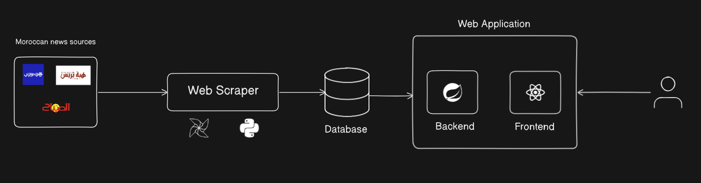
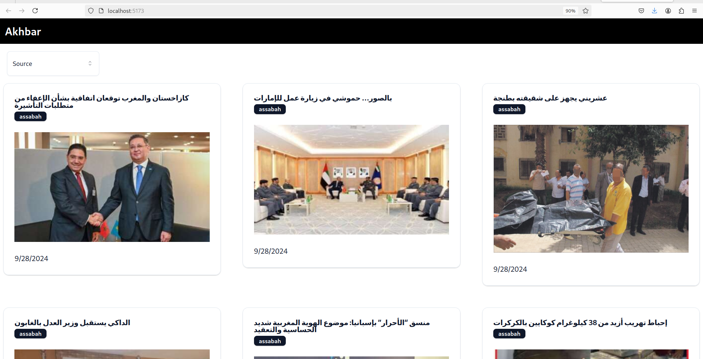
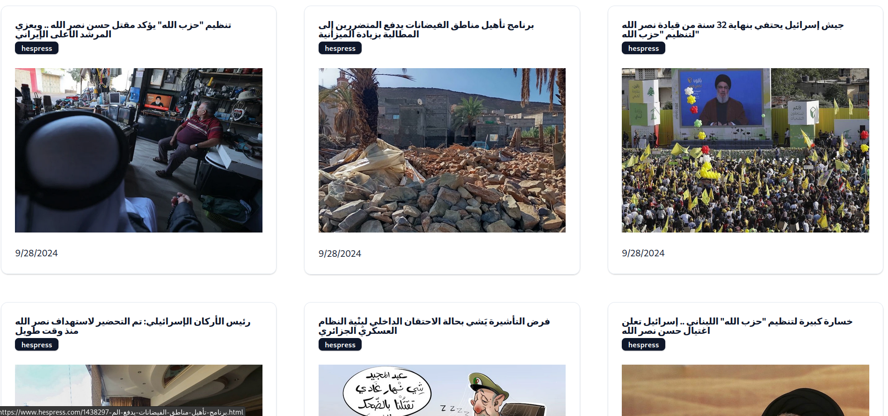

# Moroccan News Aggregator

## Project Overview

The Moroccan News Aggregator is a full-stack web application that collects news articles from various Moroccan news sources. Using a web scraper built with Python and Apache Airflow, the project gathers articles daily, stores them in a PostgreSQL database, and serves the data through a user-friendly web interface powered by Spring Boot and React.

## Features

- **Automated Scraping**: The system scrapes multiple Moroccan news sources daily using Apache Airflow to ensure real-time news updates.
- **Web Application**: A user-friendly web interface allows users to browse categorized news.
- **API**: The backend exposes RESTful endpoints to retrieve categorized news articles.
- **PostgreSQL Database**: Efficient data storage for high-volume news articles, enabling fast query responses.

## Tech Stack

- **Backend**:
  - Python (for web scraping)
  - Apache Airflow (for job scheduling)
  - Spring Boot (for API and backend services)
- **Frontend**:
  - React.js (for the user interface)
- **Database**:
  - PostgreSQL (for data storage)
- **Others**:
  - Docker (for containerization)
  - AI Model (for categorizing articles)

## Architecture

Below is the architecture of the Moroccan News Aggregator:

## Final Results

Here’s a glimpse of the final web application:

1. 

2. 
